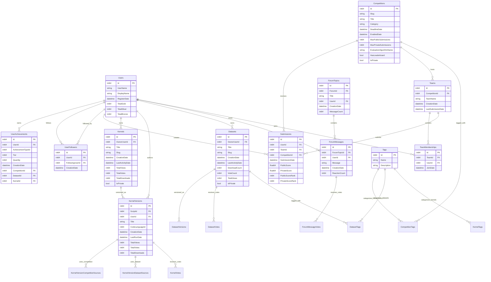
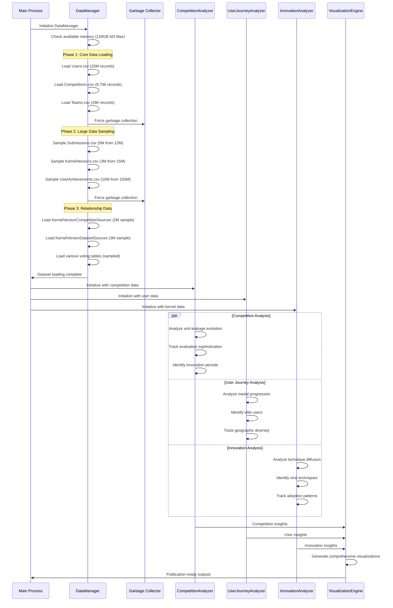
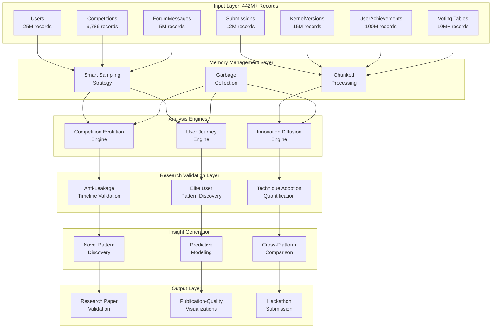
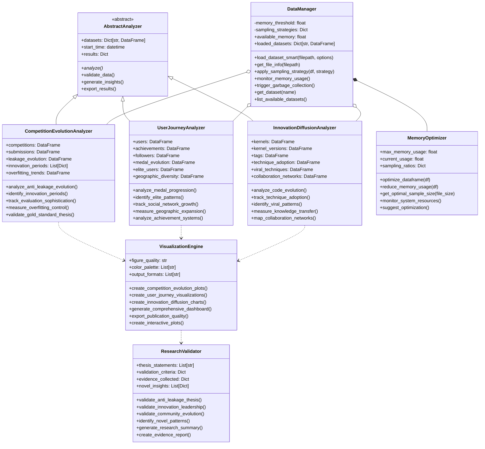
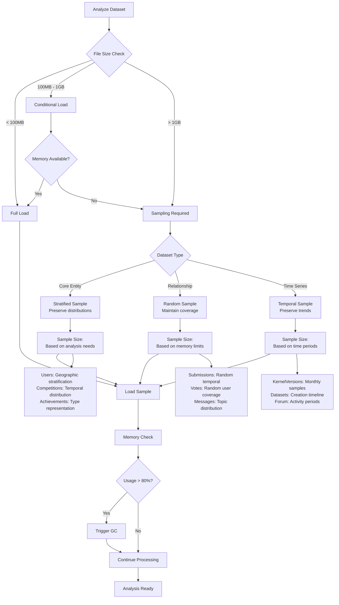
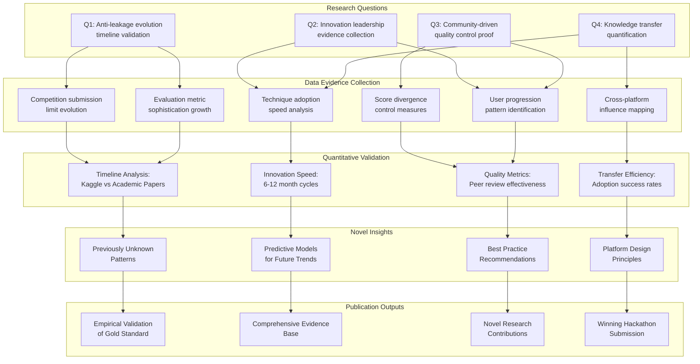

# Detailed Technical Diagrams: Data Processing & Analysis Flows

## 1. Complete Entity Relationship Diagram

### Primary Entities & Cardinalities

## 2. Data Processing Sequence Diagram

### Memory-Optimized Loading Sequence

## 3. Analysis Pipeline Architecture

### Multi-Dimensional Analysis Flow

## 4. Detailed Class Architecture

### Core Analysis Framework

## 5. Data Sampling Strategy Flow

### Intelligent Sampling Decision Tree

## 6. Research Validation Framework

### Thesis Validation Pipeline

## 7. Implementation Roadmap

### Development Phases & Milestones

```mermaid
gantt
    title Kaggle Meta Analysis Implementation Timeline
    dateFormat X
    axisFormat %d
    
    section Phase 1: Foundation
    Data Architecture Design    :done, arch, 0, 2
    Memory Strategy Implementation :done, mem, 1, 3
    Core Data Loading System    :active, load, 2, 5
    
    section Phase 2: Core Analysis
    Competition Evolution Engine :anal1, 4, 8
    User Journey Analysis Engine :anal2, 5, 9
    Innovation Diffusion Engine  :anal3, 6, 10
    
    section Phase 3: Validation
    Research Thesis Testing     :valid1, 8, 12
    Novel Pattern Discovery     :valid2, 9, 13
    Evidence Collection         :valid3, 10, 14
    
    section Phase 4: Output
    Visualization Generation    :viz, 12, 16
    Publication Preparation     :pub, 14, 18
    Hackathon Submission       :submit, 16, 20
```

This comprehensive technical architecture provides the detailed blueprints needed to implement the Kaggle Meta Analysis project successfully. The modular design ensures scalability while the memory optimization strategies enable processing of the massive 442M+ record dataset on available hardware.
