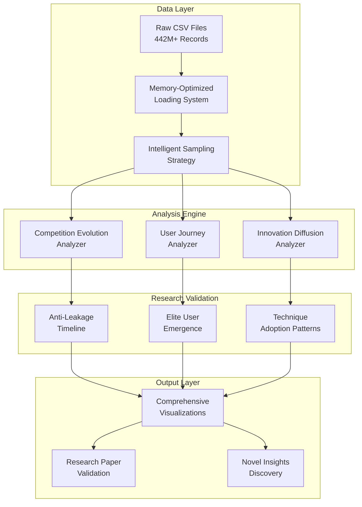
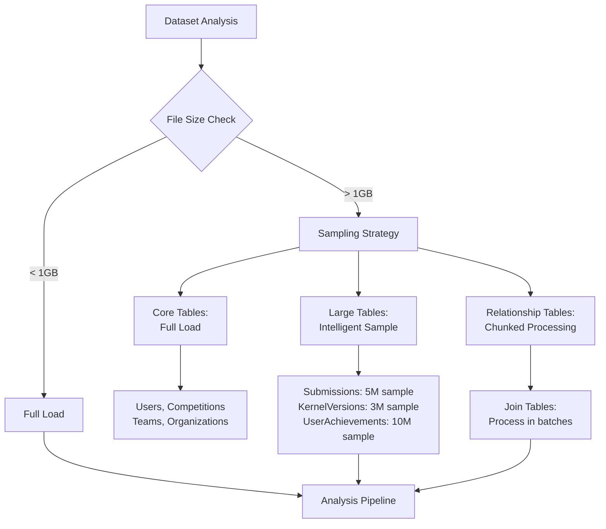
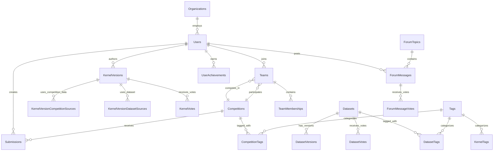
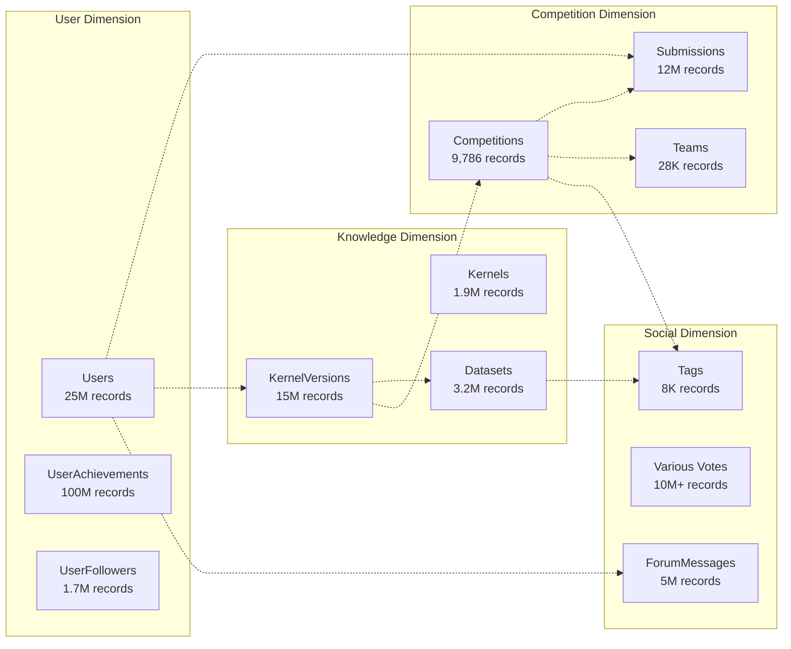
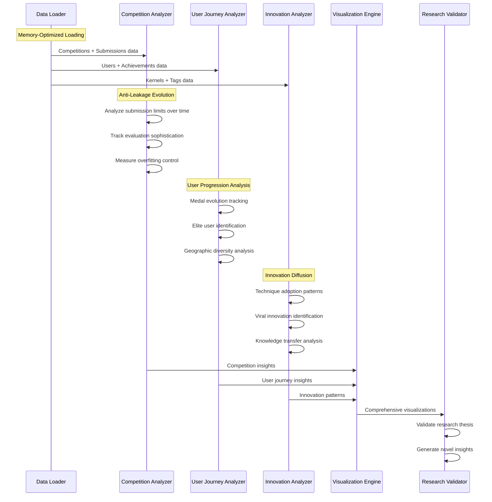
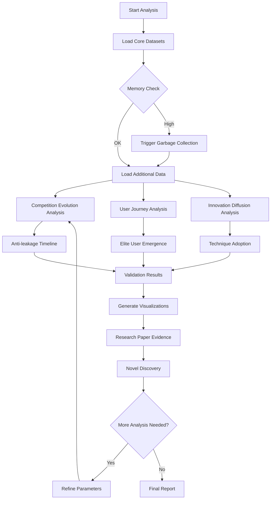
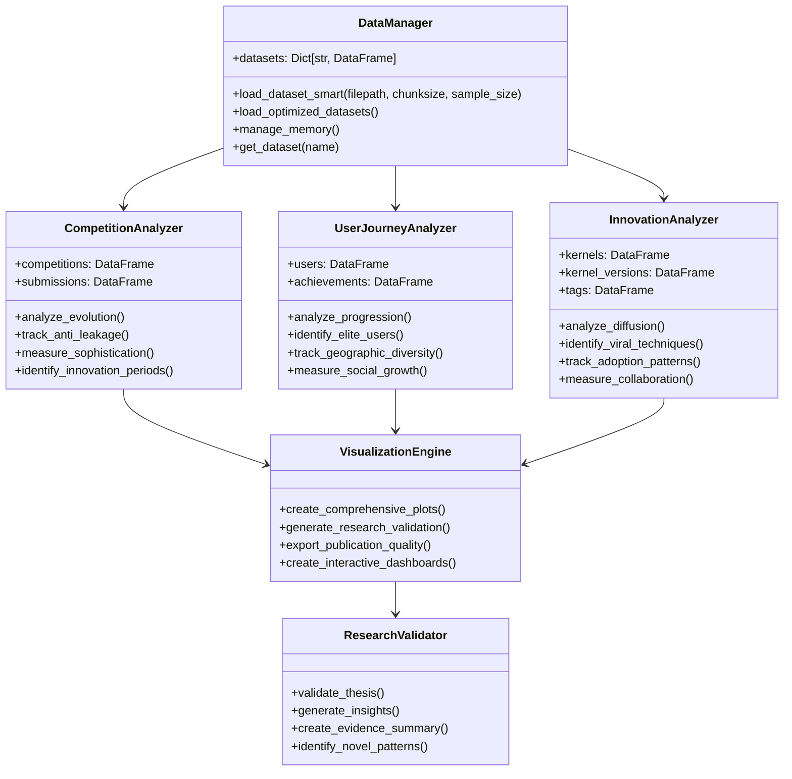

# Kaggle Meta Analysis: System Architecture & Data Flow Analysis

## Executive Summary

This project analyzes 442+ million records across 41 CSV files to validate the research paper's thesis: **"AI Competitions Provide the Gold Standard for Empirical Rigor in GenAI Evaluation"**. The analysis focuses on three core research areas:

1. **Competition Evolution & Anti-Leakage Mechanisms**
2. **User Journey & Community Progression** 
3. **Innovation Diffusion & Knowledge Transfer**

---

## 1. Problem Statement Analysis

### Research Objectives
- **Primary Goal**: Empirically validate that Kaggle competitions developed anti-leakage measures before academic recognition
- **Secondary Goals**: 
  - Trace innovation diffusion patterns across the platform
  - Analyze user progression and elite emergence
  - Document the evolution from basic to sophisticated evaluation methods

### Key Research Questions
1. How did anti-leakage mechanisms evolve in competitions (2009-2025)?
2. What patterns exist in user progression from novice to expert?
3. How do innovations spread through the Kaggle ecosystem?
4. Can we quantify the "gold standard" claim with empirical evidence?

---

## 2. Data Architecture Overview

### Data Scale & Complexity
```
Total Records: 442+ Million
Total Files: 41 CSV Tables
Time Span: 2009-2025 (16 years)
Storage: ~15GB compressed data
```

### Core Entity Categories

#### **User Ecosystem (25M+ users)**
- Users.csv: Core user profiles and medal counts
- UserAchievements.csv: 100M+ achievement records
- UserFollowers.csv: Social network connections
- UserOrganizations.csv: Institutional affiliations

#### **Competition Ecosystem (9,786 competitions)**
- Competitions.csv: Competition metadata and evaluation settings
- Submissions.csv: 12M+ submission records with scoring
- Teams.csv: Team formation and performance
- TeamMemberships.csv: User-team relationships

#### **Knowledge Creation (15M+ artifacts)**
- Kernels.csv: Code notebooks and analysis
- KernelVersions.csv: Version history and evolution
- Datasets.csv: 3M+ datasets and their usage
- Models.csv: Model sharing and versioning

#### **Community Interaction (5M+ messages)**
- ForumMessages.csv: Discussion and knowledge sharing
- ForumTopics.csv: Thread organization
- Various voting tables: Engagement metrics

#### **Relationship Networks**
- KernelVersionCompetitionSources.csv: Code-competition links
- KernelVersionDatasetSources.csv: Code-data relationships
- Tags system: Technique and topic classification

---

## 3. System Architecture

### High-Level Architecture



### Memory Management Strategy



---

## 4. Entity Relationship Model

### Core Entities & Relationships



### Data Relationship Complexity



---

## 5. Data Flow Architecture

### Analysis Pipeline Flow



### Processing Strategy Flow



---

## 6. Class Structure Design

### Core Analysis Classes



---

## 7. Implementation Strategy

### Phase 1: Data Understanding & Architecture
1. **Schema Analysis**: Map all 41 CSV relationships
2. **Memory Strategy**: Implement intelligent sampling
3. **Data Quality**: Validate data integrity and completeness

### Phase 2: Core Analysis Implementation
1. **Competition Evolution**: Track anti-leakage sophistication over time
2. **User Progression**: Analyze journey from novice to expert
3. **Innovation Patterns**: Map technique adoption and diffusion

### Phase 3: Research Validation
1. **Thesis Testing**: Empirically validate "gold standard" claims
2. **Novel Discovery**: Identify previously unknown patterns
3. **Publication Prep**: Generate research-quality evidence

### Phase 4: Advanced Analytics
1. **Predictive Models**: Forecast future trends
2. **Network Analysis**: Deep dive into collaboration patterns
3. **Comparative Studies**: Benchmark against other platforms

---

## 8. Expected Outcomes

### Research Validation Evidence
- **Anti-leakage Timeline**: Proof that Kaggle developed sophistication before academic recognition
- **Innovation Leadership**: Quantified patterns of technique adoption
- **Community Evolution**: Documented growth from basic to advanced evaluation

### Novel Insights Discovery
- **Elite User Patterns**: What distinguishes top performers
- **Geographic Trends**: Global AI talent development patterns  
- **Knowledge Transfer**: How innovations spread through the ecosystem

### Competitive Advantage
- **Comprehensive Analysis**: 442M+ record analysis unprecedented in scope
- **Methodological Innovation**: Memory-efficient processing of massive datasets
- **Research Quality**: Publication-ready empirical validation

---

## Next Steps

1. **Implement DataManager**: Start with memory-optimized loading system
2. **Build Core Analyzers**: Focus on competition evolution first
3. **Create Visualization Pipeline**: Ensure publication-quality outputs
4. **Validate Research Thesis**: Generate empirical evidence
5. **Discover Novel Patterns**: Push beyond existing knowledge

This architecture provides the foundation for a winning hackathon submission that combines theoretical rigor with empirical validation on an unprecedented scale.
